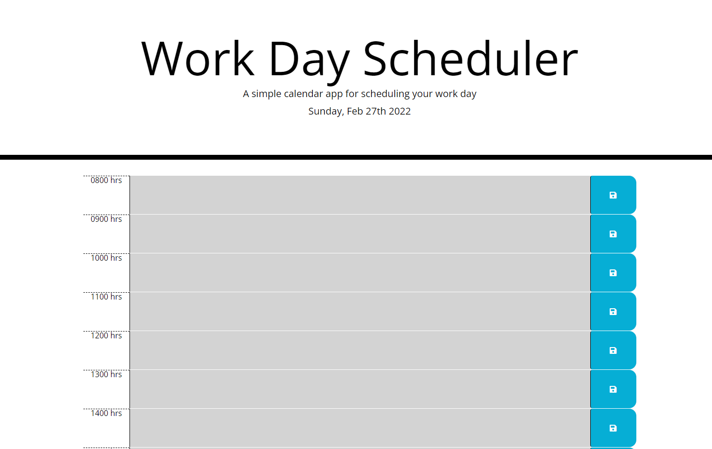
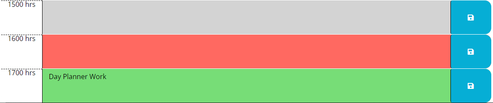

# Day-Planner

## [Day Planner](https://jsnyder159.github.io/Day-Planner/)

## Description

Task is to make a calender application that allows a user to save events for each hour of normal business hours.

Criteria:  The daily planner when opened should display the current day at the top of the calender.  When scrolling through the application there should be time blocks for standard business hours.  When viewing the time blocks they should have a color associated with them for past, present, and future times.  When clicking on the time block you should be able to input an event.  When the save button is clicked the input information should be saved to local storage.  When the page is refreshed the saved events should persist.

Steps Taken:

- HTML built so that all hours are there. (0800-1700hrs.)

- Bootstrap used for proper display layout.

- CSS used for style format.

- Save button added and icon given to it.

- jQuery used to make functions.

- Moment used to give current day information.

- Local storage used to save information put into display boxes.

- getItem used to pull information saved in local storage so information persists through page refresh.

- Function created to check the current time VS the time blocks associated time.  If its a past time color will be grey, if current time it will be red, and if future time color for block will be green.

